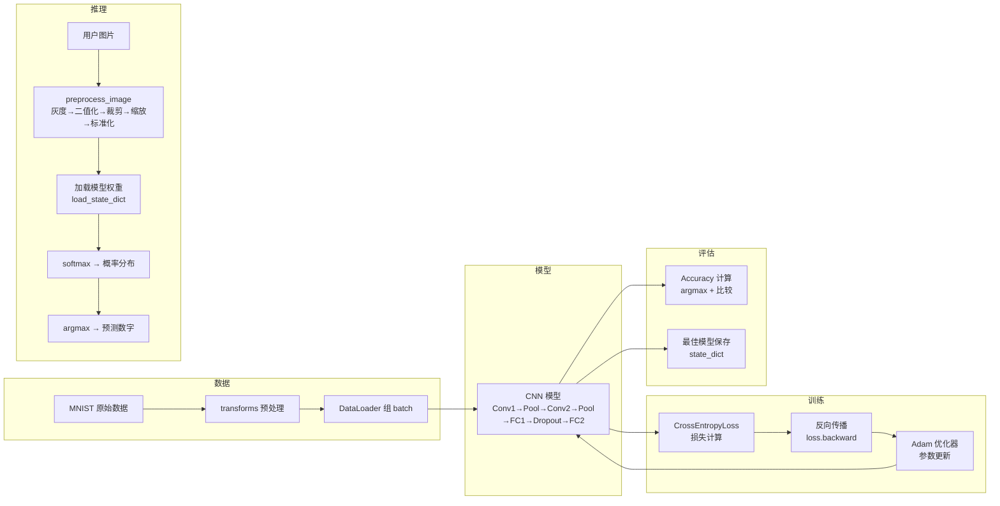
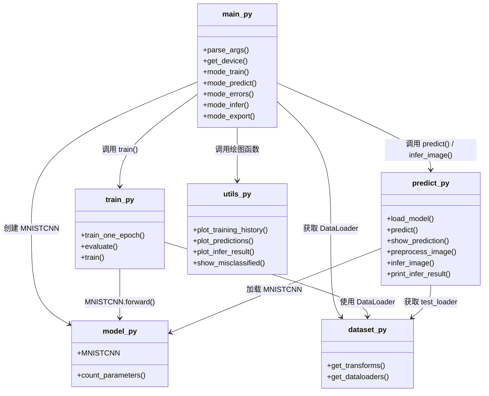
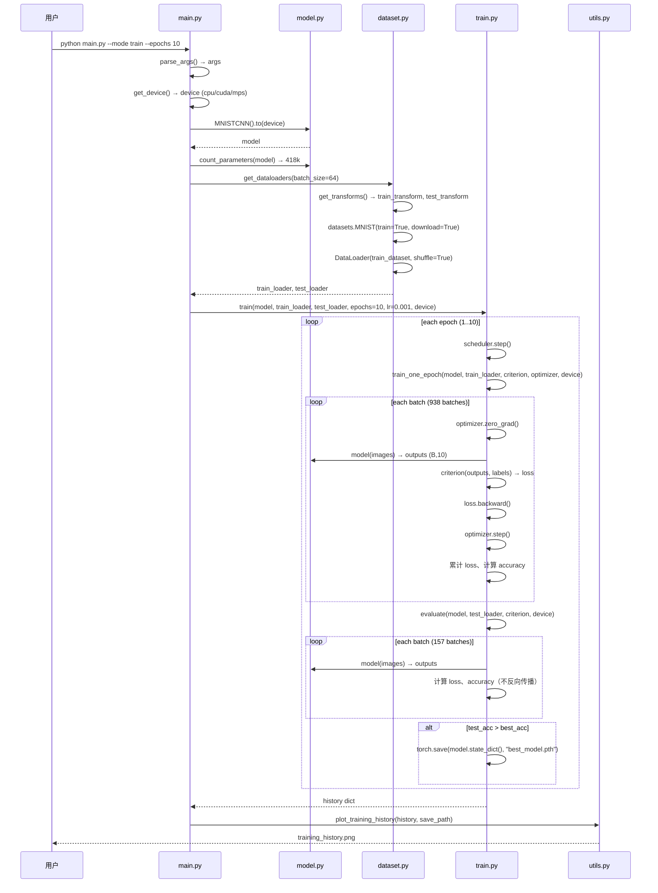
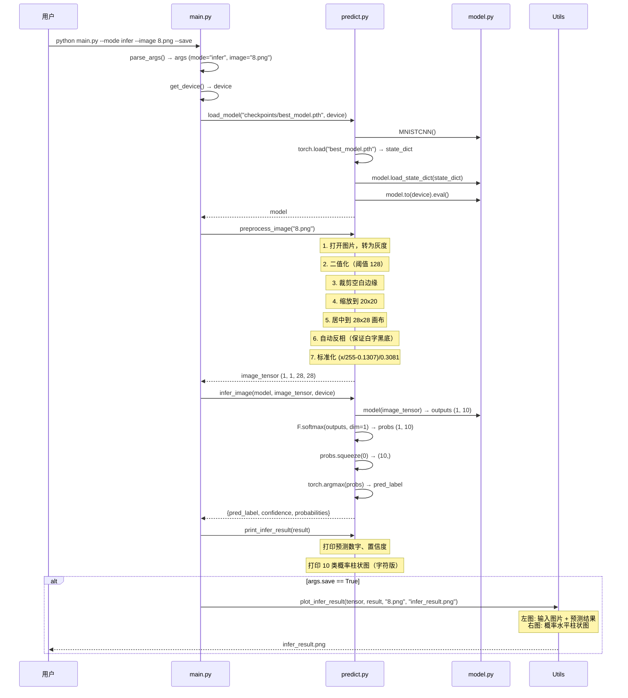

# 手写数字识别（Handwritten Digit Recognition）— 完整学习文档

---

## 1. 项目概览

### 一句话定位

这是一个**基于 PyTorch 卷积神经网络（Convolutional Neural Network, CNN）的手写数字识别**入门项目，输入一张 28×28 像素的灰度手写数字图片，输出 0–9 的预测结果。

### 简介

**解决什么问题？** 让计算机"看懂"手写数字。一张图片上画了一个歪歪扭扭的"7"，计算机能不能正确地把它识别为数字 7？这个项目就是解决这个经典问题——MNIST 手写数字分类（MNIST Handwritten Digit Classification）。

**用什么方法？** 使用一个**两层卷积神经网络（2-layer CNN）**，通过 PyTorch 框架实现。模型从原始像素中自动学习"边缘→局部图案→全局形状"的层次化特征，最后用全连接层（Fully Connected Layer）映射到 10 个数字类别的概率分布。整个 pipeline 覆盖了数据加载、数据增强、模型训练、评估、保存、推理和可视化。

**最终能做什么？**
- 在 MNIST 测试集上达到约 **99% 的识别准确率**
- 对**用户提供的任意手写数字图片**（手机拍摄、绘图软件涂鸦）进行推理
- 可视化训练过程中的损失/准确率曲线、预测结果的混淆情况、每张图片各类别概率分布

### 技术栈清单

| 组件 | 名称与版本 |
|------|-----------|
| 深度学习框架 | PyTorch ≥ 2.0.0 |
| 数据处理 | torchvision ≥ 0.15.0 |
| 科学计算 | NumPy ≥ 1.24.0 |
| 可视化 | Matplotlib ≥ 3.7.0 |
| 图像处理 | Pillow（PIL，通过 torchvision 间接依赖） |

从实际 import 提取的依赖：

```
torch         — 核心张量计算、自动求导、神经网络模块
torch.nn      — 网络层（Conv2d, Linear, Dropout, MaxPool2d）
torch.nn.functional — 激活函数（ReLU, softmax）
torch.optim   — 优化器（Adam, lr_scheduler.StepLR）
torch.utils.data.DataLoader — 数据加载器
torchvision.datasets — MNIST 数据集下载与管理
torchvision.transforms — 图像预处理（ToTensor, Normalize, RandomAffine）
matplotlib.pyplot    — 绘图与可视化
numpy                — 图像数组操作
PIL.Image            — 图片文件读写与处理
pathlib.Path        — 跨平台路径处理
argparse            — 命令行参数解析
```

### 运行环境要求

- **Python 版本**：≥ 3.8（PyTorch 2.x 的要求）
- **硬件支持**：
  - CPU 即可运行（训练约 5–10 分钟完成 10 个 epoch）
  - GPU（CUDA）/ Apple MPS（M1/M2 Mac）会显著加速
  - 显存需求：约 **500MB**（batch_size=64 时极低）
  - 内存需求：≤ 4GB
- **操作系统**：macOS / Linux / Windows 均可

---

## 2. 目录结构与文件职责

### 完整目录树

```
digits_learn/
│
├── main.py                  # 【入口文件】CLI 统一入口，解析参数并调度各模块
├── model.py                 # 【模型定义】CNN 网络结构 + 参数量计算
├── dataset.py               # 【数据脚本】数据增强、加载、DataLoader 组装
├── train.py                 # 【训练脚本】训练循环 + 评估 + 模型保存
├── predict.py               # 【推理脚本】批量预测 + 单图推理 + 图片预处理
├── utils.py                 # 【工具文件】可视化函数（训练曲线、预测结果、错例分析）
├── requirements.txt         # Python 依赖清单
│
├── data/                    # 数据集目录
│   └── MNIST/raw/           # torchvision 自动下载的 MNIST 原始文件
│       ├── train-images-idx3-ubyte        # 训练集图片 (60000 张)
│       ├── train-labels-idx1-ubyte        # 训练集标签 (60000 个)
│       ├── t10k-images-idx3-ubyte         # 测试集图片 (10000 张)
│       └── t10k-labels-idx1-ubyte         # 测试集标签 (10000 个)
│
├── checkpoints/             # 训练输出目录（自动创建）
│   ├── best_model.pth       # 【权重文件】验证集准确率最高的模型参数
│   ├── training_history.png # 损失与准确率曲线图
│   ├── predictions.png      # 批量预测结果可视化
│   ├── infer_result.png     # 单图推理结果可视化
│   └── misclassified.png    # 预测错误样本展示
│
└── test_images/             # 从 MNIST 导出的推理测试图片
    ├── mnist_0_3.png        # 数字 0，第 3 张
    ├── mnist_1_2.png        # 数字 1，第 2 张
    └── ...                  # 其余类推
```

### 文件职责速览

| 文件 | 类型 | 一句话职责 |
|------|------|-----------|
| `main.py` | **入口文件** | 接收命令行参数，调度训练/预测/推理/导出等模式 |
| `model.py` | **模型定义文件** | 定义 CNN 的网络结构（Conv→Pool→FC）和参数量统计 |
| `dataset.py` | **数据脚本** | 定义数据增强流程，加载 MNIST 并组装为 DataLoader |
| `train.py` | **训练脚本** | 实现单 epoch 训练、评估、完整训练循环与最佳模型保存 |
| `predict.py` | **推理脚本** | 实现测试集批量预测、单图预处理与推理 |
| `utils.py` | **工具文件** | 提供训练曲线、预测可视化、错例分析、推理结果图等绘图函数 |
| `requirements.txt` | 配置文件 | 列出 Python 依赖包 |
| `checkpoints/best_model.pth` | **权重文件** | 训练完成后保存的最佳模型 `state_dict` |

---

## 3. 整体架构

### 3.1 数据流



### 3.2 模块依赖关系



### 3.3 架构设计思路

这个项目的分层非常清晰，遵循**入口调度 → 模块各司其职**的架构风格：

1. **解耦（Separation of Concerns）**：每个 Python 文件只负责一个领域——模型只管网络结构，数据只管加载变换，训练只管循环逻辑，可视化工只管画图。任何一个模块的修改（例如把 CNN 换成 ResNet）都不会牵连其他文件。

2. **入口统一（Unified Entry Point）**：所有功能通过 `main.py` + 命令行参数 `--mode` 调用，避免了"要训练去跑 A 脚本、要推理去跑 B 脚本"的混乱。

3. **设备无关（Device Agnostic）**：`get_device()` 自动检测 CUDA / MPS / CPU，所有张量和模型通过 `.to(device)` 灵活迁移，代码无需硬编码设备类型。

4. **面向学习者（Learner-Friendly）**：每个函数都有完整的 docstring，参数类型标注清晰，关键的张量形状变化在注释中写明（例如 `(B, 32, 14, 14)`），方便读者追踪数据流动。

---

## 4. 核心模块逐个拆解

### 4.1 数据加载与预处理 — `dataset.py`

#### 作用

定义数据预处理流程，自动下载 MNIST 数据集，组装为 PyTorch 的 DataLoader，供训练和评估使用。

#### 关键函数：`get_transforms()`

```python
def get_transforms():
    # 训练集: 水平翻转 + 旋转 + 转Tensor + 标准化
    train_transform = transforms.Compose([
        transforms.RandomAffine(
            degrees=10,              # 随机旋转 ±10 度
            translate=(0.1, 0.1),    # 随机平移 ±10%
        ),
        transforms.ToTensor(),       # PIL -> Tensor，像素值归一化到 [0, 1]
        transforms.Normalize(
            mean=(0.1307,),          # MNIST 数据集像素均值
            std=(0.3081,),           # MNIST 数据集像素标准差
        ),
    ])
```

**逐行解读：**

- `transforms.Compose([...])`：将多个图像变换操作串联成一个 pipeline，执行顺序是自上而下的。
- `RandomAffine(degrees=10, translate=(0.1, 0.1))`：**数据增强（Data Augmentation）**。对每张图片随机旋转最多 ±10 度，随机平移最多 ±10%。这样模型见过"歪一点""偏一点"的数字，泛化能力更强。
  - 代码中注释写"水平翻转"，但 `RandomAffine` 实际上做的是旋转+平移，没有水平翻转。这是代码注释的一个小偏差，以实际代码行为准。
- `ToTensor()`：将 PIL Image（像素值 0–255）转为 PyTorch 的 `torch.FloatTensor`，**同时自动将像素值归一化到 [0, 1]**。形状从 `(H, W)` 变为 `(1, H, W)`。
- `Normalize(mean=(0.1307,), std=(0.3081,))`：对每个像素做标准化：`x = (x - mean) / std`。这里的 `0.1307` 和 `0.3081` 是整个 MNIST 训练集的像素均值和标准差，是预先统计好的常数。标准化后像素值大致服从均值为 0、方差为 1 的分布，有助于模型收敛。

> **为什么训练集和测试集的 transform 不同？**
> 训练集使用数据增强（随机旋转/平移）来增加数据多样性、减少过拟合。测试集不使用增强，只做必要的 `ToTensor` 和 `Normalize`，保证每次评估的输入一致、结果可复现。

#### 关键函数：`get_dataloaders()`

```python
train_dataset = datasets.MNIST(
    root=data_dir,     # 存储路径
    train=True,        # 加载训练集
    download=True,     # 如果本地没有则自动下载
    transform=train_transform,
)

train_loader = DataLoader(
    dataset=train_dataset,
    batch_size=batch_size,
    shuffle=True,       # 训练集打乱
    num_workers=2,      # 2 个子进程并行加载
    pin_memory=True,    # 加速 GPU 数据传输
)
```

**逐行解读：**

- `datasets.MNIST(...)`：torchvision 内置的数据集类。`download=True` 会在首次运行时自动从网络下载 MNIST 的 4 个 gz 文件到 `data/MNIST/raw/` 目录。
- `DataLoader(...)`：PyTorch 的数据加载器，核心作用是将数据集**自动组装成 batch**。
  - `batch_size=64`：每次迭代返回 64 张图片和对应的 64 个标签。
  - `shuffle=True`：训练集每个 epoch 重新打乱顺序，避免模型记住数据顺序。
  - `num_workers=2`：用 2 个并行进程预读取数据，减少 CPU 等待时间。
  - `pin_memory=True`：将数据固定在内存的"锁页"区域，加速从 CPU 到 GPU 的数据拷贝。仅在 GPU 训练时有意义，但设置为 `True` 在 CPU 模式也不会报错。

#### 输入 / 输出

| 变量 | 形状 | 数据类型 | 含义 |
|------|------|---------|------|
| `images` | `(batch_size, 1, 28, 28)` | `torch.float32` | 标准化后的灰度图片 batch |
| `labels` | `(batch_size,)` | `torch.int64` | 对应的真实数字标签（0–9） |

---

### 4.2 模型定义 — `model.py`

#### 作用

定义用于 MNIST 分类的卷积神经网络（CNN）结构，以及计算模型参数量的辅助函数。

#### 网络结构总览

```
输入: (batch_size, 1, 28, 28)   灰度图
  │
  ├─ Conv2d(1→32, 3×3, padding=1)  +  ReLU  →  (B, 32, 28, 28)
  ├─ MaxPool2d(2×2, stride=2)                   →  (B, 32, 14, 14)
  │
  ├─ Conv2d(32→64, 3×3, padding=1) +  ReLU  →  (B, 64, 14, 14)
  ├─ MaxPool2d(2×2, stride=2)                   →  (B, 64, 7, 7)
  │
  ├─ Flatten (view)                              →  (B, 3136)
  │
  ├─ Linear(3136→128) + ReLU                     →  (B, 128)
  ├─ Dropout(0.5)
  ├─ Linear(128→10)                              →  (B, 10)   ← logits
  │
输出: (batch_size, 10)   10 个类别的原始得分（logits）
```

#### 类：`MNISTCNN`

```python
class MNISTCNN(nn.Module):
    def __init__(self):
        super().__init__()
        self.conv1 = nn.Conv2d(1, 32, kernel_size=3, padding=1)
        self.conv2 = nn.Conv2d(32, 64, kernel_size=3, padding=1)
        self.pool = nn.MaxPool2d(kernel_size=2, stride=2)
        self.fc1 = nn.Linear(64 * 7 * 7, 128)
        self.fc2 = nn.Linear(128, 10)
        self.dropout = nn.Dropout(0.5)
```

**逐层解读：**

##### 第一卷积层 `self.conv1`

```python
nn.Conv2d(in_channels=1, out_channels=32, kernel_size=3, padding=1)
```

- **输入**：`(B, 1, 28, 28)` — 单通道灰度图
- **参数**：`kernel_size=3` 表示 3×3 的卷积核（filter），`padding=1` 表示在图片四周各补一圈 0，保持输出尺寸与输入相同
- **运算**：32 个不同的 3×3 卷积核分别与输入做卷积，每个卷积核提取一种特征（例如横线、竖线、角点）。每个卷积核的参数量为 `3×3×1 + 1(bias) = 10`，32 个共 320 个参数
- **输出**：`(B, 32, 28, 28)` — 32 张特征图（feature maps），每张 28×28

##### 池化层 `self.pool`

```python
nn.MaxPool2d(kernel_size=2, stride=2)
```

- **作用**：用 2×2 窗口取最大值，步长为 2，相当于把特征图尺寸减半（28→14）
- **目的**：
  1. **降维**：减少参数量和计算量
  2. **平移不变性**：轻微的位置偏移不影响池化结果
  3. **扩大感受野**：后续卷积能看到更大的区域
- **参数量**：0（池化层没有可学习参数）

##### 第二卷积层 `self.conv2`

```python
nn.Conv2d(in_channels=32, out_channels=64, kernel_size=3, padding=1)
```

- **输入**：`(B, 32, 14, 14)` — 上一层的 32 张特征图
- **输出**：`(B, 64, 14, 14)` — 提取 64 个更抽象的特征
- **设计意图**：第一层学边缘、纹理等低级特征（low-level features），第二层在低级特征基础上组合出形状、图案等高级特征（high-level features）。通道数从 32 翻倍到 64，是因为经过池化后空间尺寸减半，增加通道数可以保留足够的信息容量。

##### 展平 `x.view(x.size(0), -1)`

- **输入**：`(B, 64, 7, 7)`
- **输出**：`(B, 3136)` — 把 `64×7×7` 的三维特征图拉直成一维向量
- `x.size(0)` 取 batch_size，`-1` 自动计算剩余维度：`64 * 7 * 7 = 3136`

##### 第一全连接层 `self.fc1`

```python
nn.Linear(64 * 7 * 7, 128)
```

- **输入**：`(B, 3136)` — 展平后的所有特征
- **输出**：`(B, 128)` — 128 维的隐藏表示
- **参数量**：`3136 × 128 + 128(bias) = 401,536`，占模型总参数的大头

##### Dropout 层 `self.dropout`

```python
nn.Dropout(0.5)
```

- **作用**：训练时以 50% 的概率随机将神经元的输出置为 0
- **目的**：防止过拟合（overfitting），强迫网络不能依赖某个特定的神经元，从而学到更鲁棒的特征
- **注意**：`model.eval()` 切换评估模式时，Dropout 自动关闭

##### 第二全连接层 `self.fc2`

```python
nn.Linear(128, 10)
```

- **输入**：`(B, 128)`
- **输出**：`(B, 10)` — 对应 0–9 共 10 个数字的原始得分（logits）
- **参数量**：`128 × 10 + 10 = 1,290`

#### 前向传播 `forward()`

```python
def forward(self, x):
    x = self.pool(F.relu(self.conv1(x)))   # (B, 32, 14, 14)
    x = self.pool(F.relu(self.conv2(x)))   # (B, 64, 7, 7)
    x = x.view(x.size(0), -1)              # (B, 3136)
    x = F.relu(self.fc1(x))                # (B, 128)
    x = self.dropout(x)
    x = self.fc2(x)                        # (B, 10)   ← logits
    return x
```

**关键设计决策**：

1. **输出 logits 而非概率**：`self.fc2` 直接输出原始得分（logits），Softmax 留给损失函数 `CrossEntropyLoss` 内部处理。这是因为 `CrossEntropyLoss` 在内部同时做了 Softmax + 交叉熵计算，分开会导致数值精度损失。

2. **激活函数全部用 ReLU**：`F.relu(x) = max(0, x)`。ReLU 的优势是计算简单、梯度不饱和（不像 Sigmoid 在两端梯度接近 0），能有效缓解梯度消失问题（vanishing gradient problem）。

3. **网络只在最后 2 层是全连接**：前几层用卷积的原因是——对于图像数据，卷积层能利用空间局部性（相邻像素有关联），参数量远少于全连接层，而且具有平移不变性。

#### 辅助函数：`count_parameters()`

```python
def count_parameters(model):
    return sum(p.numel() for p in model.parameters() if p.requires_grad)
```

- `p.numel()` 返回张量中元素总数
- `p.requires_grad` 确保只统计可训练参数（而非冻结的参数）
- 当前模型总参数量约为 **~418,000**，对于现代 GPU 来说是极小的网络

---

### 4.3 损失函数与优化器 — `train.py`

#### 损失函数：`nn.CrossEntropyLoss()`

见第 6 章原理深挖部分的详细讲解。

#### 优化器：`torch.optim.Adam`

```python
optimizer = torch.optim.Adam(model.parameters(), lr=0.001)
```

**为什么用 Adam？**

- Adam（Adaptive Moment Estimation）是目前最常用的自适应学习率优化器
- 它结合了 Momentum（动量）和 RMSProp（自适应学习率）的优点：
  - **动量**：梯度更新时考虑之前的更新方向，减少震荡
  - **自适应学习率**：每个参数有不同的学习率，频繁更新的参数学习率小，稀疏更新的参数学习率大
- 相比 SGD，Adam 对学习率不那么敏感、收敛更快，适合初学者快速上手

**为何 lr=0.001 是常见默认值？** Adam 论文推荐默认学习率为 0.001，在实践中对大多数问题都工作良好。

#### 学习率调度器：`StepLR`

```python
scheduler = torch.optim.lr_scheduler.StepLR(optimizer, step_size=5, gamma=0.5)
```

- 每 `step_size=5` 个 epoch，学习率乘以 `gamma=0.5`
- 例如：初始 lr=0.001 → 第 5 epoch 后变为 0.0005 → 第 10 epoch 后变为 0.00025
- **目的**：训练后期学习率减小，帮助损失函数在极小值附近精细收敛，避免震荡

---

### 4.4 训练循环 — `train.py`

#### 函数：`train_one_epoch()`

```python
def train_one_epoch(model, loader, criterion, optimizer, device):
    model.train()                # 切换到训练模式
    for images, labels in loader:
        images = images.to(device)
        labels = labels.to(device)

        optimizer.zero_grad()    # 清零梯度
        outputs = model(images)  # 前向传播
        loss = criterion(outputs, labels)  # 计算损失
        loss.backward()          # 反向传播，计算梯度
        optimizer.step()         # 更新参数

        # 统计
        _, predicted = torch.max(outputs, 1)
        correct += (predicted == labels).sum().item()
```

**每个操作的时序与作用**：

```
1. model.train()            → 通知模型进入训练模式（Dropout 开启）
2. optimizer.zero_grad()    → 清空上一次 batch 的梯度（梯度默认会累积！）
3. outputs = model(images)  → 前向传播：输入 → 各层计算 → 输出 logits
4. loss = criterion(...)    → 计算预测与真实标签之间的差距
5. loss.backward()          → 反向传播：计算 loss 对所有参数的梯度
6. optimizer.step()         → 用梯度更新所有参数：θ = θ - lr × ∇θ
```

**为什么需要 `optimizer.zero_grad()`？**
PyTorch 的梯度是累积的（accumulate）。不清零的话，每个 batch 的梯度会叠加到上一个 batch 上，导致参数更新方向错误。所以**每个 batch 开始前必须清零**。

#### 函数：`evaluate()`

```python
@torch.no_grad()
def evaluate(model, loader, criterion, device):
    model.eval()
    for images, labels in loader:
        outputs = model(images)
        loss = criterion(outputs, labels)
        ...
```

关键点：

- **`@torch.no_grad()` 装饰器**：禁用梯度计算上下文。评估时不需要反向传播，禁用后大幅减少显存占用并加速计算。
- **`model.eval()`**：切换到评估模式。影响 Dropout（关闭）和 BatchNorm（使用全局统计量而非 batch 统计量）。
- **评估也计算 loss**：虽然不更新参数，但记录测试集 loss 有助于监控是否过拟合（overfitting）——如果训练 loss 持续下降但测试 loss 开始上升，说明过拟合了。

#### 函数：`train()` — 完整训练循环

```python
def train(model, train_loader, test_loader, epochs, lr, device, save_dir):
    criterion = nn.CrossEntropyLoss()
    optimizer = torch.optim.Adam(model.parameters(), lr=lr)
    scheduler = torch.optim.lr_scheduler.StepLR(optimizer, step_size=5, gamma=0.5)

    for epoch in range(1, epochs + 1):
        train_loss, train_acc = train_one_epoch(...)
        test_loss, test_acc = evaluate(...)
        scheduler.step()

        if test_acc > best_acc:
            torch.save(model.state_dict(), model_path)
```

**每个 epoch 的完整流程**：

```
for each epoch:
  1. train_one_epoch()          → 遍历所有训练 batch，更新参数
  2. evaluate()                 → 遍历所有测试 batch，计算准确率
  3. scheduler.step()           → 调整学习率
  4. 如果 test_acc 创新高      → 保存模型 state_dict
```

---

### 4.5 评估与指标

#### 准确率（Accuracy）

```python
_, predicted = torch.max(outputs, 1)     # 取每行最大值的索引 → 预测类别
correct += (predicted == labels).sum()   # 预测正确的样本数
accuracy = correct / total               # 正确数 / 总数
```

**计算方式**：
- `torch.max(outputs, 1)` 返回每一行（每张图片）最大 logit 所在的列索引，即模型认为最可能的数字
- `predicted == labels` 得到一个布尔张量，`.sum()` 统计其中 `True` 的个数
- 最终除以总样本数得到准确率

#### 模型保存

```python
torch.save(model.state_dict(), "checkpoints/best_model.pth")
```

- `model.state_dict()` 是一个 Python 字典，key 是层名称（如 `conv1.weight`），value 是对应的权重张量
- 只保存参数（不保存网络结构），加载时需要先实例化 `MNISTCNN()` 再调用 `load_state_dict()`
- 保存的是**验证集准确率最高的那个 epoch 的模型**，而非最后一个 epoch 的

---

### 4.6 推理 / 预测流程 — `predict.py`

#### 批量预测：`predict()`

```python
@torch.no_grad()
def predict(model, loader, device, num_samples=10):
    for images, labels in loader:
        outputs = model(images)
        probs = F.softmax(outputs, dim=1)      # logits → 概率
        _, predicted = torch.max(outputs, 1)
```

- 收集指定数量 `num_samples` 的图片、真实标签、预测标签和各类别概率
- `F.softmax(outputs, dim=1)`：沿第 1 维（类别维）做 Softmax，将 logits 转为和为 1 的概率

#### 单图推理：`infer_image()`

```python
@torch.no_grad()
def infer_image(model, image_tensor, device):
    image_tensor = image_tensor.to(device)
    outputs = model(image_tensor)
    probs = F.softmax(outputs, dim=1).squeeze(0)  # (10,)
    pred_label = torch.argmax(probs).item()
    confidence = probs[pred_label].item()
```

- 输入形状 `(1, 1, 28, 28)`，输出形状 `(1, 10)`
- `squeeze(0)` 去掉 batch 维度 → `(10,)`
- `argmax` 取概率最大的索引作为预测数字

#### 单图预处理（核心）：`preprocess_image()`

这是推理流程中最关键也最复杂的函数。它把用户提供的**任意格式/尺寸/背景色的手写图片**转换成模型可以接受的 `(1, 1, 28, 28)` 标准化张量。

```python
def preprocess_image(image_path, size=28):
    # 1. 打开图片，转为灰度
    img = Image.open(image_path).convert("L")

    # 2. 二值化: 阈值 128
    img = img.point(lambda p: 255 if p > threshold else 0)

    # 3. 裁剪空白边缘
    arr = np.array(img)
    rows = np.any(arr < 255, axis=1)
    cols = np.any(arr < 255, axis=0)
    y_min, y_max = np.where(rows)[0][[0, -1]]
    x_min, x_max = np.where(cols)[0][[0, -1]]
    img = img.crop((x_min, y_min, x_max + 1, y_max + 1))

    # 4. 保持宽高比缩放到 20x20
    img = img.resize((new_w, new_h), Image.LANCZOS)

    # 5. 居中放置在 28x28 黑色画布
    canvas = Image.new("L", (28, 28), 0)
    canvas.paste(img, (x_offset, y_offset))

    # 6. 自动反相: MNIST 是白字黑底
    if tensor.mean() > 127:
        tensor = 255 - tensor

    # 7. 标准化: (x/255 - 0.1307) / 0.3081
    tensor = (tensor / 255.0 - 0.1307) / 0.3081
```

**设计意图逐步骤**：

| 步骤 | 为什么做 |
|------|---------|
| 灰度化 | MNIST 是灰度图，去掉颜色信息 |
| 二值化 | 消除噪声和渐变，只有"有无笔迹"两种状态 |
| 裁剪空白 | 去除多余的背景区域，使数字占画面更大比例 |
| 缩放到 20×20 | MNIST 处理标准——数字部分约占 20×20 像素 |
| 居中到 28×28 | 和 MNIST 数据集格式一致（数字在正中央） |
| 自动反相 | MNIST 数据集是"白字黑底"，用户图片可能是"黑字白底" |
| 标准化 | 与训练时的 `Normalize(0.1307, 0.3081)` 保持一致 |

---

### 4.7 可视化工具 — `utils.py`

#### `plot_training_history()` — 训练曲线

- 左子图：训练 loss（蓝线）vs 测试 loss（红线）
- 右子图：训练准确率（蓝线）vs 测试准确率（红线）
- 帮助判断：是否收敛、是否过拟合（测试 loss 反弹）

#### `plot_predictions()` — 批量预测可视化

- 每张图片下方显示：真实标签、预测标签、置信度
- 颜色编码：**绿色=预测正确，红色=预测错误**
- 反标准化：`img = img * 0.3081 + 0.1307` 将标准化后的张量还原为可视化的灰度值

#### `plot_infer_result()` — 单图推理结果

- 左子图：输入图片 + 预测数字
- 右子图：水平柱状图展示 10 个类别的概率分布
- 预测的数字用绿色高亮，其他为红色
- 在每个柱上标注百分比数值

#### `show_misclassified()` — 错误样本分析

- 筛选出所有预测错误的样本
- 最多展示 10 张，每张标注"真实值 → 预测值"
- 有助于分析模型弱点（例如：是否经常把 4→9、7→2 等容易混淆的数字搞错）

---

## 5. 端到端运行流程（Step by Step）

### 5.1 训练阶段完整流程



**关键数字**（以 batch_size=64、epochs=10 为例）：

| 指标 | 数值 |
|------|------|
| 训练集样本数 | 60,000 |
| 测试集样本数 | 10,000 |
| 每个 epoch 训练 batch 数 | 60,000 / 64 ≈ 938 |
| 每个 epoch 测试 batch 数 | 10,000 / 64 ≈ 157 |
| 总训练步数（梯度更新次数） | 938 × 10 = 9,380 |
| 预计总时长（CPU） | 5–10 分钟 |
| 预计总时长（CUDA/MPS） | 1–3 分钟 |

### 5.2 推理阶段完整流程



---

## 6. 原理深挖（学习向）

### 6.1 卷积（Convolution）是怎么提取数字特征的？

**直观理解**：卷积核（kernel）就是一个小"特征探测器"（detector），在图片上滑动扫描，每个位置计算卷积核覆盖区域与核权重的**点积（dot product）**。

假设一个 3×3 的卷积核专门检测"垂直边缘"：

```
图片区域（灰度值）：        3×3 卷积核（权重）：
 10  20  30                   -1   0   1
 40  50  60          ×         -1   0   1
 70  80  90                   -1   0   1

卷积运算 = 每个位置相乘再求和
= 10×(-1) + 20×0 + 30×1 + 40×(-1) + 50×0 + 60×1 + 70×(-1) + 80×0 + 90×1
= 60（正值 → 检测到垂直边缘）
```

**在这个项目中的具体表现**：

- `self.conv1` 有 32 个卷积核，每个 3×3。它们会学到 32 种基本的"视觉基元"（primitives）——水平线、垂直线、对角线、小斑点等。
- `self.conv2` 有 64 个卷积核，在第一层输出的基础上组合出更复杂的图案——例如一个圆圈（多个弧线组合）、一个拐角等。
- 经过两层卷积 + 池化后，全连接层（FC）把 64×7×7 个"局部图案检测结果"组合成全局判断——"这些特征组合起来最像数字 3"。

**为什么卷积比全连接更适合图像？**

| 对比 | 卷积层 | 全连接层 |
|------|--------|---------|
| 参数量（28×28→32 特征图） | 3×3×1×32 + 32 = **320** | 28×28×32 + 32 = **25,120** |
| 局部连接 | 是（只看 3×3 邻域） | 否（看所有像素） |
| 平移不变性 | 有（卷积核在图上滑动） | 无 |

CNN 通过 **权值共享（weight sharing）** 和**局部连接（local connectivity）**，用远少于全连接的参数量达到更好的图像识别效果。

### 6.2 Softmax + CrossEntropy 为什么是分类标配？

#### Softmax

模型最后一层输出 10 个数字的原始得分（logits）：$z = [z_0, z_1, ..., z_9]$。

Softmax 将 logits **映射为和为 1 的概率分布**：

$$
\hat{y}_i = \frac{e^{z_i}}{\sum_{j=0}^{9} e^{z_j}}
$$

- 分子 $e^{z_i}$：正指数保证概率 > 0
- 分母 $\sum e^{z_j}$：归一化，确保 $\sum \hat{y}_i = 1$

例如，logits `[2.0, 0.5, 0.1, ...]` 经过 Softmax 变为 `[0.65, 0.14, 0.09, ...]`，即"模型 65% 确信是数字 0"。

#### 交叉熵损失（CrossEntropy Loss）

交叉熵衡量**两个概率分布之间的差异**——模型预测的分布 $\hat{y}$ 和真实分布的 one-hot 编码 $y = [0,0,...,1,...,0]$（正确类别位置为 1，其余为 0）：

$$
L = -\sum_{i=0}^{9} y_i \log \hat{y}_i = -\log \hat{y}_{true}
$$

- 因为 $y_i$ 只有 true 位置为 1，其余为 0，所以最终简化为 $-\log(\text{正确类别的预测概率})$
- **直观理解**：模型对正确答案越有把握（预测概率接近 1），loss 越小（接近 0）；越没把握（概率小），loss 越大
- $L = -\log(0.99) \approx 0.01$，$L = -\log(0.1) \approx 2.3$

**为什么 CrossEntropy 比 MSE（均方误差）更适合分类？**
- MSE 对"概率接近 0.8 vs 0.9"的惩罚是线性的，但 CrossEntropy 对"错误但自信"（例如高置信度预测为 8，但实际是 3）的惩罚是指数级的，更符合分类目标。
- 梯度下降时，CrossEntropy + Softmax 的组合梯度形式简洁（$\nabla L = \hat{y} - y$），更新效率高。

### 6.3 反向传播（Backpropagation）在这个网络里如何流动？

以一次训练迭代为例，从 loss 到各层参数的梯度计算路径：

```
loss = CrossEntropyLoss(outputs, labels)
       │
       ├─ ▲ outputs (B, 10) ← logits  ←  fc2.weight, fc2.bias
       │                                ↑
       │                             dropout ← 前一层梯度
       │                                ↑
       │                              fc1.weight, fc1.bias
       │                                ↑
       │                            x.view(flatten) ← reshape
       │                                ↑
       │                           pool2.maxpool ← conv2.weight, conv2.bias
       │                                ↑
       │                           relu ← 梯度 = 1（正区间） or 0（负区间）
       │                                ↑
       │                           pool1.maxpool ← conv1.weight, conv1.bias
       │                                ↑
       │                           relu ← 梯度 = 1（正区间） or 0（负区间）
       │
       └─ labels
```

`loss.backward()` 触发**自动微分**（Automatic Differentiation, Autograd）：PyTorch 自动沿着计算图的反方向，**逐层计算 loss 对每个参数的偏导数（梯度）**。

关键梯度流通规则：
- **ReLU**：输入 > 0 时梯度不变通过，输入 ≤ 0 时梯度截断为 0（这就是"神经元死亡"的原因）
- **MaxPool**：梯度只回传到池化窗口中最大值的位置，其他位置梯度为 0
- **CrossEntropy**：梯度简化为 $\hat{y} - y$（预测概率 − one-hot 标签）

### 6.4 为什么 MNIST 用这个网络就够，复杂场景需要怎么升级？

**够用的原因**：
- MNIST 数据集本身很简单：28×28 灰度、数字居中、背景干净、类别少（10 类）
- 训练集 60,000 张图片和测试集 10,000 张图片在规模上适中
- 两层 CNN 约 418k 参数足够拟合这个任务，测试准确率可达 99%+

**复杂场景需要的升级**：
- **彩色图片 / 更大的输入尺寸**：需要更深的网络（ResNet、VGG）或更多的卷积层和更大的卷积核
- **自然场景中的数字（如 SVHN 街景门牌号）**：背景复杂、角度变化大、光照不一致 → 需要更多数据增强、可能要用到 Batch Normalization、更深的网络
- **数字定位 + 识别（如端到端的电话号码识别）**：需要目标检测模型（YOLO、Faster R-CNN）或多阶段 pipeline
- **生产环境高精度要求（金融票据、银行支票）**：可能需要集成模型（ensemble）、额外后处理规则、模型蒸馏（knowledge distillation）等

---

## 7. 复现指南

### 7.1 环境安装

```bash
# 推荐使用虚拟环境
python -m venv digits_env
source digits_env/bin/activate  # Windows: digits_env\Scripts\activate

# 安装依赖（建议 PyTorch 官网单独安装以获取 CUDA 支持）
pip install torch torchvision  # 访问 pytorch.org 获取适合你硬件的命令
pip install matplotlib numpy
pip install -r requirements.txt
```

**各依赖最低版本**（从 `requirements.txt` 提取）：

```
torch >= 2.0.0
torchvision >= 0.15.0
matplotlib >= 3.7.0
numpy >= 1.24.0
```

### 7.2 数据准备

数据会自动下载，无需手动操作。首次运行训练时：

```bash
python main.py --mode train
```

程序会自动检测 `data/` 目录下是否已有 MNIST 数据，如果没有则从网络下载到 `data/MNIST/raw/`。如果网络下载慢，可以手动从以下链接下载 4 个 gz 文件并放置到对应目录：

- `train-images-idx3-ubyte.gz`
- `train-labels-idx1-ubyte.gz`
- `t10k-images-idx3-ubyte.gz`
- `t10k-labels-idx1-ubyte.gz`

### 7.3 训练命令与超参数说明

```bash
# 最简训练
python main.py --mode train

# 自定义训练
python main.py --mode train --epochs 15 --batch-size 128 --lr 0.0005
```

| 超参数 | 默认值 | 取值范围 | 说明与影响 |
|--------|-------|---------|-----------|
| `--epochs` | 10 | 5–30 | 遍历全部训练数据的次数。更多 epoch 通常准确率更高，但可能过拟合 |
| `--batch-size` | 64 | 16–256 | 每次梯度更新使用的样本数。越大梯度越稳定，但显存占用越高。64 是主流选择 |
| `--lr` (学习率) | 0.001 | 0.0001–0.01 | 梯度更新的步长。Adam 适合 lr=0.001。偏小收敛慢，偏大可能不收敛 |

**训练过程中的自动行为**：
- 每个 epoch 结束后在测试集上评估一次
- 学习率在第 5 和第 10 个 epoch 减半（StepLR）
- 自动保存测试准确率最高的模型权重到 `checkpoints/best_model.pth`
- 训练完成后在 `checkpoints/training_history.png` 生成训练曲线

**典型输出**：

```
当前设备: cpu
训练参数: epochs=10, batch_size=64, lr=0.001
模型参数量: 418,506
训练集 batch 数: 938
测试集 batch 数: 157
 Epoch | Train Loss | Train Acc | Test Loss | Test Acc |   Time
----------------------------------------------------------------------
     1 |     0.2410 |    0.9307 |    0.0636 |   0.9798 |  18.6s
     2 |     0.0780 |    0.9765 |    0.0440 |   0.9858 |  19.2s
   ...
    10 |     0.0131 |    0.9961 |    0.0174 |   0.9935 |  18.9s
```

### 7.4 推理 / Demo 运行命令

```bash
# 方式一：通过 main.py（推荐）
python main.py --mode infer --image path/to/your/digit.png
python main.py --mode infer --image test_images/mnist_3_0.png --save

# 方式二：直调用 predict.py（需要先有训练好的模型）
python predict.py path/to/your/digit.png

# 测试集批量预测 + 可视化
python main.py --mode predict --num 30

# 导出测试集图片用于推理测试
python main.py --mode export --num 10

# 查看预测错误样本
python main.py --mode errors
```

### 7.5 常见报错与排查

| 错误 | 原因 | 解决方案 |
|------|------|---------|
| `RuntimeError: CUDA out of memory` | GPU 显存不足 | 减小 `--batch-size`（如 32 或 16），或在 CPU 上运行 |
| `AssertionError: Torch not compiled with CUDA enabled` | PyTorch 版本不支持 CUDA | `get_device()` 会自动降级到 CPU，不影响功能。如需 GPU 加速，重新安装 CUDA 版 PyTorch |
| `FileNotFoundError: No such file or directory: 'checkpoints/best_model.pth'` | 训练未完成或路径错 | 先运行 `python main.py --mode train` |
| `RuntimeError: shape mismatch` | 自定义图片尺寸/通道不符 | `preprocess_image()` 会自动处理，但如果手动修改代码导致维度不匹配，检查 `unsqueeze` 和 `to(device)` |
| `URLError: 下载 MNIST 数据集失败` | 网络原因无法连接到 MNIST 服务器 | 手动下载 4 个 gz 文件放到 `data/MNIST/raw/` |
| `ValueError: The truth value of an array with more than one element is ambiguous` | `preprocess_image()` 中 `rows.any() and cols.any()` | 输入图片全白或全黑，没有任何数字笔迹。换一张有数字的图片 |

---

## 8. 可改进点与延伸学习

### 8.1 工程优化（不改变模型行为）

| 方向 | 具体做法 | 效果 |
|------|---------|------|
| 日志系统 | 用 `logging` 模块替代 `print` | 支持不同级别（INFO/DEBUG）、输出到文件和终端、时间戳 |
| 配置集中化 | 将超参数放入单独的 `config.py` 或 YAML/JSON 文件 | 避免修改代码来调参 |
| 训练进度条 | 使用 `tqdm` 库显示训练进度 | 实时看到每个 batch 的进度和 loss 变化 |
| 早停（Early Stopping） | 当测试集 loss 连续 N 个 epoch 不再下降时自动停止训练 | 节省时间，防止过拟合 |
| 实验记录 | 集成 TensorBoard 或 MLflow，记录 loss/acc/lr 曲线 | 方便多组实验对比 |
| 异常处理 | 在 `preprocess_image()` 中增加更多的出错保护（图片损坏、格式不支持） | 提升鲁棒性 |
| 类型检查 | 用 `mypy` 做静态类型检查 | 提高代码可维护性 |

### 8.2 模型改进方向

| 方向 | 做法 | 预期提升 |
|------|------|---------|
| 数据增强（Data Augmentation） | 添加随机遮挡（RandomErasing）、弹性变换等 | 增强泛化能力，减少过拟合 |
| Batch Normalization | 在卷积层后添加 `nn.BatchNorm2d` | 加速收敛，减少对初始学习率的敏感度 |
| 更深网络 | 增加第 3 个卷积层（例如 64→128） | 可能提升少量准确率（对于 MNIST 提升空间很小） |
| 更先进的架构 | 尝试 LeNet-5、ResNet-18 或 MobileNet | 学习经典架构设计思想 |
| 学习率调度优化 | 使用 CosineAnnealingLR、ReduceLROnPlateau | 更平滑的学习率衰减 |
| 权重初始化 | 使用 Kaiming 初始化（`nn.init.kaiming_normal_`） | 改善深层网络的梯度流动 |

### 8.3 延伸学习方向

1. **部署（Deployment）**
   - 用 **ONNX Runtime** 将模型导出为 `.onnx` 格式进行推理加速
   - 用 **Flask / FastAPI** 包装为 REST API，用 `curl` 或 Postman 调用
   - 用 **TorchScript** 将模型序列化，集成到 C++ 或移动端应用
   - 用 **TFLite** 部署到 Android / iOS 手机端

2. **迁移学习（Transfer Learning）**
   - 在 MNIST 上训练好的模型可作为"数字特征提取器"，迁移到其他数字识别任务（如验证码识别）

3. **解释性（Explainability）**
   - 用 **Grad-CAM** 可视化模型关注图像的哪些区域
   - 分析卷积核的实际响应模式（哪个卷积核被哪些数字激活）

4. **更难的数据集**
   - **Fashion-MNIST**：同样是 28×28 灰度，但分类衣服/鞋子，替换数据集即可
   - **SVHN**：街景门牌号识别，自然场景中的数字
   - **EMNIST**：扩展 MNIST，包含字母和数字

5. **生产级优化**
   - 模型量化（Quantization）：将 FP32 权重转为 INT8，模型大小减少 75%，推理速度提升 2–4 倍
   - 模型蒸馏（Knowledge Distillation）：用大模型（教师）指导小模型（学生）训练，在参数量不变的前提下提升精度

---

## 9. 从本项目到大模型：需要补齐的知识版图

本项目是一个**基于 CNN 的图像分类器**，参数量 418k，训练 5 分钟。而大语言模型（Large Language Model, LLM）是基于 Transformer 的自回归文本生成模型，参数量从 70M 到 405B 不等，训练数据以万亿 token 计。两者在架构、数据形态、训练目标、规模层面存在本质差异。

本章梳理从本项目出发，补齐哪些知识才能完整理解大模型，以及可以在本项目的代码基础上做什么实验来亲手"触摸"这些差异。

### 9.1 五个核心维度对比

| 维度 | 本项目（CNN MNIST） | 大语言模型（LLM） |
|------|-------------------|-------------------|
| 模型架构 | Conv2d + MaxPool + FC | Transformer（Self-Attention + FFN + LayerNorm） |
| 输入形态 | 固定尺寸图像 `(B, 1, 28, 28)` | 可变长度 token 序列 `(B, seq_len)` → Embedding → `(B, seq_len, d)` |
| 输出形态 | 10 个类别的概率 `(B, 10)` | 词表上的概率分布 `(B, seq_len, vocab_size)`，逐 token 生成 |
| 训练目标 | 分类 CrossEntropy | 语言建模（next token prediction），CrossEntropy over vocabulary |
| 数据规模 | 60k 标签图片 | 数万亿 token 文本（自监督，无需人工标签） |

---

### 9.2 架构缺口：从 CNN 到 Transformer

#### 9.2.1 理解 Self-Attention

这是最核心的跃迁。CNN 的核心操作是**局部卷积**——每个卷积核只看 3×3 邻域；Attention 的核心操作是**全局加权求和**——每个位置可以关注所有其他位置。

**Scaled Dot-Product Attention 公式**：

$$
\text{Attention}(Q, K, V) = \text{softmax}\left(\frac{QK^T}{\sqrt{d_k}}\right)V
$$

- $Q$（Query）：当前 token 的查询向量
- $K$（Key）：所有 token 的键向量，用来和 Query 匹配
- $V$（Value）：所有 token 的值向量，加权求和的内容
- 除以 $\sqrt{d_k}$：防止内积过大导致 softmax 梯度饱和

**建议实验**：在这个项目上用 PyTorch 手写单头 Self-Attention，把第一层 Conv2d 替换掉。将 28×28 图像视为 784 个 token，每个 token 的特征是 1 维（灰度值），加上可学习位置编码后送入 Attention。对比替换前后模型在 MNIST 上的准确率和收敛速度。

#### 9.2.2 理解多头注意力（Multi-Head Attention）

多头并行的设计哲学：$h$ 个头各自独立做 Attention，拼接后投影回原维度。

$$
\text{MultiHead}(Q, K, V) = \text{Concat}(\text{head}_1, \dots, \text{head}_h)W_O
$$

每个头可以关注不同类型的模式——一个关注全局形状，一个关注局部纹理，一个关注位置关系。

#### 9.2.3 理解位置编码（Positional Encoding）

Self-Attention 没有顺序感——如果不加位置编码，"12"和"21"在 Attention 看来是一样的。Transformer 需要在输入中注入位置信息。

- **原始方案**：正弦/余弦固定频率编码（Sinusoidal PE），不需要学习
- **现代方案**：可学习位置编码（learned PE）、RoPE（旋转位置编码，Llama 系列使用）

**建议实验**：把位置编码加到 MNIST 图像输入中（每个像素的坐标编码后和像素值拼接），对比有无位置编码时 Attention 的表现。

#### 9.2.4 理解归一化层差异

| 归一化方式 | 归一化维度 | 本项目的使用 |
|-----------|-----------|-------------|
| BatchNorm | 对每个通道，跨 batch 归一化 | CNN 常用，本项目未使用 |
| LayerNorm | 对每个样本，跨特征维归一化 | Transformer 标配 |

对比本质：BatchNorm 依赖 batch 统计量（训练和推理行为不同），LayerNorm 不依赖 batch 大小且训练/推理一致。

---

### 9.3 任务形态缺口：从分类到自回归生成

本项目是**判别式**任务：输入一张图片，输出一个类别标签。LLM 是**生成式**任务：输入一串 token，逐步预测下一个 token。

#### 9.3.1 训练目标的变化

本项目（10 类分类）：

$$
L_{\text{cls}} = -\log(\text{预测正确类别的概率})
$$

LLM（next token prediction，词表大小约 100k）：

$$
L_{\text{LM}} = -\sum_{t=1}^{T} \log P(\text{token}_t \mid \text{token}_{<t})
$$

数学上都是 CrossEntropy，但 LLM 的"类别数"从 10 变成了 ~100,000（词表大小），并且序列中的每个位置都有一个独立预测任务。

#### 9.3.2 因果掩码（Causal Masking）

自回归生成的核心约束：token 只能关注它前面的 token，不能看到后面的。

```
注意力矩阵（seq_len=5，灰色=被掩码的位置）：
[■ □ □ □ □]   第1个token只能看自己
[■ ■ □ □ □]   第2个token可以看1和2
[■ ■ ■ □ □]
[■ ■ ■ ■ □]
[■ ■ ■ ■ ■]
```

实现上即对 Attention 的 softmax 之前的上三角区域置为 $-\infty$。

**建议实验**：在本项目的 Attention 实现中引入因果掩码，观察"单向"信息流对分类准确率的影响——对于数字识别，单向 vs 双向的信息量差异有多大？

#### 9.3.3 自回归推理循环

本项目推理是一次前向：

```python
outputs = model(image_tensor)   # 一步出结果
```

LLM 推理是循环生成：

```python
for _ in range(max_new_tokens):
    logits = model(input_ids)                    # 前向传播，shape (1, seq_len, vocab_size)
    next_token_id = sample(logits[:, -1, :])     # 只取最后一个位置的预测做采样
    input_ids = torch.cat([input_ids, next_token_id], dim=1)  # 拼接回输入
```

每次只生成一个 token，然后拼回输入，再生成下一个。这是"一次性预测"到"逐步生成"的根本转变，也是 LLM inference 为什么比分类模型慢一个数量级的原因。

**关键概念：KV Cache**。在自回归推理中，前 $T$ 个 token 的 Key 和 Value 在每一步都被重复计算。KV Cache 将每一层的 $K$ 和 $V$ 缓存下来，每一步只计算新 token 的 $K$ 和 $V$，避免冗余计算。

---

### 9.4 数据表示缺口：从原始像素到离散 Token

#### 9.4.1 Tokenization（分词）

本项目输入已经是数字（像素值 0–255），模型可以直接处理。

LLM 的输入是原始文本字符串，必须先通过 Tokenizer 转化为 token ID 序列。

**Byte-Pair Encoding（BPE，GPT 系列使用）**：

1. 从字符级别开始
2. 统计文本中最频繁出现的相邻 token 对
3. 将高频对合并为一个新 token
4. 重复直到词表达到目标大小（如 32k 或 100k）

例如 `"hello"` 可能被切分为 `["he", "llo"]`，而不是字符级切分。

#### 9.4.2 Embedding 层

本项目输入是像素值，直接送入 Conv2d。LLM 输入是 token ID `(B, seq_len)`，经过 `nn.Embedding(vocab_size, d_model)` 映射为稠密向量 `(B, seq_len, d_model)`。

Embedding 层本质上是一个**查找表**（lookup table），token ID 3 取第 3 行向量。这个向量是**从数据中学到的语义表示**——语义相近的 token，其嵌入向量在空间中也接近。

---

### 9.5 规模缺口：从单卡玩具到分布式训练

本项目 418k 参数，单卡 CPU 5 分钟完事。LLM 需要数百到数千张 GPU 训练数月。规模带来的不仅是算力要求，更是工程范式的根本升级。

#### 9.5.1 混合精度训练（Mixed Precision Training）

本项目使用 FP32（单精度浮点，每个参数 4 字节）。LLM 使用 FP16/BF16（半精度，每个参数 2 字节），显存减半，计算速度翻倍。

PyTorch 实现：

```python
with torch.cuda.amp.autocast():
    outputs = model(images)
    loss = criterion(outputs, labels)
```

**建议实验**：在本项目的训练循环中加入 `torch.cuda.amp`，对比 FP32 和 FP16 训练的速度、显存占用和准确率差异。

#### 9.5.2 分布式训练策略

| 策略 | 解决的问题 | 类比 |
|------|-----------|------|
| 数据并行（Data Parallelism） | 多卡各算各的 batch，同步梯度 | 多个人各自算数学题，对答案取平均 |
| 模型并行（Model Parallelism） | 单卡放不下整个模型，按层切分 | 每人负责计算一层，接力传递 |
| 张量并行（Tensor Parallelism） | 单层都放不下，按矩阵行/列切分 | 把一个大矩阵乘法拆成多个小矩阵并行算 |
| 流水线并行（Pipeline Parallelism） | 减少模型并行下的 GPU 空闲 | 工厂流水线，不同 batch 在不同工位同时处理 |

#### 9.5.3 梯度检查点（Gradient Checkpointing）

训练时不用保存中间激活值（activations），反向传播时重新计算。以约 15–20% 的计算量额外开销换取 50–70% 的显存节省。LLM 训练的标配。

#### 9.5.4 3D 并行（3D Parallelism）

即数据并行 + 张量并行 + 流水线并行三者同时使用，是现代千卡级 LLM 训练的标配方案（对应 Megatron-LM + DeepSpeed 等框架）。

---

### 9.6 训练范式缺口：从有监督到自监督 + 对齐

#### 9.6.1 有监督 vs 自监督

本项目：数据需人工标注（每张图片有数字标签）。LLM 预训练：数据天然自带标签——"下一个 token 是什么？"遮住它让模型预测即可，无需人工标注。

**建议实验**：在本项目上尝试"图片遮罩重建"——随机遮住图片的部分区域，让模型预测被遮住的像素。这就是一个视觉版的自监督学习（类似 BERT 的 Masked Language Modeling）。对比模型在少量有标签数据上"从零训练" vs "先自监督预训练再微调"的效果差异。

#### 9.6.2 LLM 的三阶段训练流程

现代 LLM（如 Llama、GPT）的标准训练 pipeline：

```
阶段 1：自监督预训练（Pre-Training）
  数据：海量无标注文本（数万亿 token）
  目标：next token prediction
  产物：base model（基础模型，只能续写文本，不"听话"）

阶段 2：有监督微调（Supervised Fine-Tuning, SFT）
  数据：（指令, 回答）对，人工标注的高质量对话数据
  目标：next token prediction（同上，但数据变了）
  产物：instruct model（开始能遵循指令）

阶段 3：偏好对齐（Reinforcement Learning from Human Feedback, RLHF）
  数据：模型多个输出的人工偏好排序
  算法：PPO / DPO（Direct Preference Optimization）
  目标：让模型说出人类更偏好的回答
  产物：aligned model（如 ChatGPT、Claude）
```

这三个阶段的**损失函数数学形式完全一致**——都是 CrossEntropy next token prediction。区别仅在于**训练数据的分布**。

#### 9.6.3 In-Context Learning（上下文学习）

LLM 不需要重新训练就能学会新任务——只需在 prompt 中给几个例子。这是自回归训练方式带来的 emergent ability。

**建议实验**：在项目的数据集上对比"常规分类" vs "把分类任务转化为语言建模格式（如 prompt=`数字是: 3，输出: three`）"，观察在少量微调数据下哪种方式效果好。

---

### 9.7 总结：从本项目到 LLM 的学习路径图

```
当前状态                       阶段 1：架构升级                   阶段 2：任务转型
┌──────────────┐            ┌──────────────────┐            ┌──────────────────┐
│ CNN + MNIST  │  ──────→   │ Transformer +    │  ──────→   │ 因果语言模型      │
│ 图像分类     │            │ MNIST 分类       │            │ Text Generation  │
│ 418k 参数    │            │ 手写 Attention    │            │ 自回归推理       │
│ 有监督训练    │            │ 对比 CNN vs Attn  │            │ next token pred  │
└──────────────┘            └──────────────────┘            └──────────────────┘
       │                              │                              │
       │ 修改 model.py                 │ 把像素当 token               │ 从图像到文本
       │ 替换卷积为 Attention           │ 加入位置编码                  │ 引入 Tokenizer
       │                              │                              │
       ▼                              ▼                              ▼
┌─────────────────────────────────────────────────────────────────────────────┐
│                          阶段 3：规模扩展 + 完整 LLM                         │
│                                                                             │
│  ┌─────────────┐  ┌─────────────┐  ┌─────────────┐  ┌───────────────────┐  │
│  │ BPE Tokenizer│  │ Embedding   │  │ 分布式训练   │  │ 混合精度 +        │  │
│  │ (文本切分)   │  │ 语义表示     │  │ 数据/模型并行 │  │ 梯度检查点        │  │
│  └─────────────┘  └─────────────┘  └─────────────┘  └───────────────────┘  │
│                                                                             │
│  ┌─────────────┐  ┌─────────────┐  ┌─────────────┐  ┌───────────────────┐  │
│  │ 预训练      │  │ SFT 微调    │  │ RLHF/DPO    │  │ KV Cache +        │  │
│  │ (自监督)    │  │ (指令对齐)   │  │ (偏好对齐)   │  │ 推理优化           │  │
│  └─────────────┘  └─────────────┘  └─────────────┘  └───────────────────┘  │
│                                                                             │
└─────────────────────────────────────────────────────────────────────────────┘
```

### 9.8 每个阶段的自学检查清单

**阶段 1：架构升级（Transformer 替代 CNN）**
- [ ] 能手写 Scaled Dot-Product Attention，讲清 Q、K、V 的含义
- [ ] 能说明为什么需要除以 $\sqrt{d_k}$
- [ ] 能解释多头注意力的拼接 + 投影过程
- [ ] 理解位置编码为什么必要，至少了解两种编码方式
- [ ] 区分 LayerNorm 和 BatchNorm 的核心差异
- [ ] 在 MNIST 上用 Transformer Encoder 跑通分类，对比 CNN 的效果

**阶段 2：任务转型（分类 → 自回归生成）**
- [ ] 理解因果掩码的原理和实现方式
- [ ] 能手写自回归推理循环（含或不含 KV Cache）
- [ ] 理解训练时 teacher forcing 和推理时自回归的区别
- [ ] 理解为什么训练时并行计算整个序列，推理时必须逐 token 生成

**阶段 3：完整 LLM**
- [ ] 理解 BPE / SentencePiece 等分词算法的工作原理
- [ ] 理解 Embedding 层本质是查找表
- [ ] 理解 Why scale？——Scaling Law 的基本结论
- [ ] 理解预训练 → SFT → RLHF 三个阶段分别做了什么、为什么需要三个阶段
- [ ] 知道什么是 KV Cache、Gradient Checkpointing、Mixed Precision Training

---

> **本项目的最大价值**：它不是大模型，但它是你亲手"把玩"深度学习的最小完整闭环。从这个闭环出发，每一个概念都可以通过**修改代码、观察变化**来验证。文档中列出的所有"建议实验"都可以在本项目代码基础上直接修改完成——这是看书、看视频无法替代的深度学习"手感"训练。
